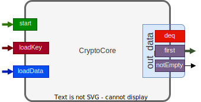

# BlueLight and CocoLight

## BlueLight an: Bluespec implementations of Lightweight Cryptography


[Bluespec SystemVerilog](https://github.com/B-Lang-org) implementations of NIST [Lightweight Cryptography](https://csrc.nist.gov/projects/lightweight-cryptography) (LWC) candidates.

Compliant with [LWC Hardware API](https://cryptography.gmu.edu/athena/LWC/LWC_HW_API.pdf).

- Bluespec LWC support package `LwcApi`

- CryptoCore implementations:
  - Xoodyak

### BlueLight CryptoCore Interface and API



BdIO is used for both input and output to/from `CryptoCore`.
```bsv
typedef struct {
  CoreWord word;   // data word
  Bool lot;        // last word of the type
  Bit#(2) padarg;  // padding argument, number of valid bytes or 0 if all valid
} BdIO;
```

```bsv
interface CryptoCoreIfc;
  method Action receive(SegmentType typ, Bool empty); // after fire, words of type `typ` will be sent to CryptoCore, if not empty
  interface FifoIn#(BdIO)  bdi; // input to CryptoCore
  interface FifoOut#(BdIO) bdo; // output from CryptoCore
endinterface
```


Code statistics (generated by `tokei`):


|  Language   |        Files |      Lines |       Code |   Comments |     Blanks |
|-------------|--------------|------------|------------|------------|------------|
|  BluespecSV |           11 |       1535 |       1056 |        181 |        298 |


# CocoLight
LWC Testbench framework based on [cocotb](https://docs.cocotb.org/) Python framework.
