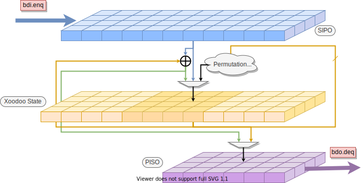

# Xoodyak LWC

Hardware implementations of Xoodyak Lightweight cryptographic scheme, as described in NIST LWC [Round 2 submission spec](https://csrc.nist.gov/CSRC/media/Projects/lightweight-cryptography/documents/round-2/spec-doc-rnd2/Xoodyak-spec-round2.pdf).

[Xoodyak](https://tosc.iacr.org/index.php/ToSC/article/view/8618) is a cryptographic primitive using 12 rounds of Xoodoo permutation with claimed security strength of 128 bits.

The implementations support both Authenticated Encryption/Decryption (AEAD) and hashing.

The implementation tries to adhere to the [KISS](https://en.wikipedia.org/wiki/KISS_principle) design principle, while adding an array of optimization tricks, making it the fastest FPGA implementation of Xoodyak.

Two Variants are available:
- **v1** (`Xoodyak`):   12 cycles permutation
- **v2** (`Xoodyak2x`): 2x unrolled, 6 cycles permutation

FPGA implementation targeting Xilinx `xc7a12tcsg325-3` using Vivado 2020.1 for maximum frequency (results obtained through [Xeda](https://github.com/XedaHQ/xeda) `fmax:vivado_synth`) 

|        |  F_max (MHz)|         LUTs |        FFs |     Slices | AD Throughput | PT/CT Throughput | Hash Throughput |
|:------:|:-----------:|-------------:|-----------:|-----------:|--------------:|-----------------:|----------------:|
| **v1** |  307        |         1523 |       1249 |        486 | 8190 Mbps     | 4467 Mbps        | 2978 Mbps       |
| **v2** |  195        |         2239 |       1228 |        668 | 5720 Mbps     | 5348 Mbps        | 3565 Mbps       |

For further details on throughput measurements and comparison to other LWC submissions, please see [here](https://eprint.iacr.org/2020/1207). Further details about Keccak Team's [implementation](https://github.com/KeccakTeam/Xoodoo/tree/master/Hardware) are available [here](https://csrc.nist.gov/CSRC/media/Projects/lightweight-cryptography/documents/round-2/status-update-sep2020/Xoodyak-update.pdf).

# `./run` script
Standalone Python script for generating verilog and running verification tests.

- `--gen`: Generate Verilog using [Bluespec Compiler](https://github.com/B-Lang-org/bsc) 
- `--gtkwave`: Generate [GTKWave](https://github.com/gtkwave/gtkwave) filters based on BSV type definitions.
- `--tests`: Choose [`cocoLight`](../cocolight) verification tests to run:
  - `randomized_tests`: randomized sequence of Encrypt, Decrypt, and Hash operations with random inputs.
  - `measure_timings`: Measure number of cycles for different operations and input sizes.